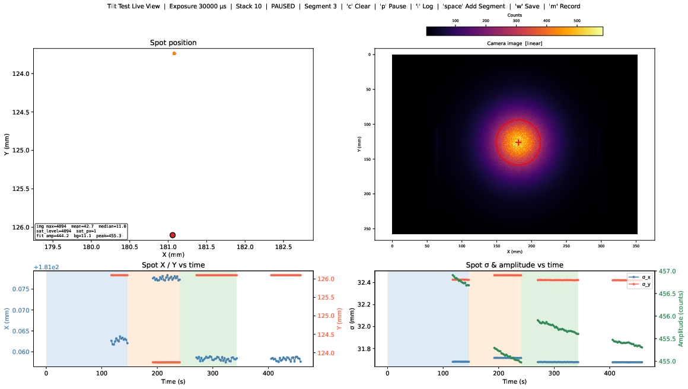

# LAB-positioner-tilt
Scripts and codes for performing the positioner tilt test


## Tilt Test Live Viewer

The script `ui/liveview.py` implements a live spot tracker for the positioner tilt test setup.
Acquires frames from a Thorlabs CS126MU camera, locates the spot on each frame, and displays the spot position and fit parameters in real time.

Two spot finding methods are selectable via `--method`:

- `gaussian` (default): fits a 2-D Gaussian (amplitude, `sigma_x`, `sigma_y`, background).
- `threshold`: thresholds the binned image at a fixed absolute count level, keeps the brightest connected component, and fits an ellipse to its boundary (the spot is imaged obliquely, so it projects as an ellipse). Requires `--threshold`. `sigma_x` / `sigma_y` then report the ellipse semi-major / semi-minor axes and `theta` its rotation.

### Setup

```bash
pip install -r requirements.txt
```

The Thorlabs TSI SDK (`thorlabs_tsi_sdk`) is not on PyPI and must be installed separately from the [Thorlabs Scientific Imaging SDK](https://www.thorlabs.com/software_pages/ViewSoftwarePage.cfm?Code=ThorCam).

On `pos-control` these requirements are usually already preinstalled, and the corresponding environment can be actived via conda:

```bash
conda activate positioner-env
```

### Usage

Run from the repository root:

```bash
python -m ui.liveview --exposure 10000
```

Key arguments:

| Argument | Default | Description |
|---|---|---|
| `--exposure` | *(required)* | Camera exposure time in µs |
| `--method` | `gaussian` | Spot finding method: `gaussian` (2-D Gaussian fit) or `threshold` (threshold + ellipse fit) |
| `--threshold` | *(none)* | Absolute count level applied to the binned image; required when `--method threshold` |
| `--clip` | `0 0 0 0` | Raw pixels to exclude from spot finding at each frame edge (`LEFT BOTTOM RIGHT TOP`), e.g. where the target screen's edge clips the spot |
| `--plate-scale` | `85.9` | Plate scale in µm/px |
| `--bin` | `4` | Spatial binning factor for spot finding |
| `--interval` | `0.5` | Minimum seconds between frames |
| `--camera` | `0` | Camera index |



### Saving data

Press `w` at any time to write all accumulated data to disk. Two files are created with the same name stem: a CSV containing one row per frame, and a PDF snapshot of the current figure. The output path can be set with `--output`; otherwise files are named `tilt_YYYYMMDD_HHMMSS.csv/.pdf` in the working directory.

The CSV columns are `time_s`, `segment`, `x_mm`, `y_mm`, `sigma_x_mm`, `sigma_y_mm`, `theta_deg`, `amplitude_counts`. `theta_deg` is the fitted spot rotation (0 for `--method gaussian`, which does not fit rotation). The `segment` column records which data segment each measurement belongs to — segments are incremented by pressing `Space` and reset to 0 by pressing `c`. Pause/resume break-points are stored as `NaN` rows.

### Keyboard shortcuts

| Key | Action |
| --- | --- |
| `c` | Clear all accumulated data and reset the clock |
| `p` | Pause / resume acquisition |
| `i` | Toggle camera image between linear and log scale |
| `Space` | Start a new data segment |
| `w` | Write all accumulated data to disk (CSV + PDF snapshot) |
| `m` | Toggle raw-frame recording — saves every frame as `.npy` into a `<stem>_frames/` folder |


## Camera Live Viewer

The script `ui/cameraview.py` implements a simple live camera viewer of the Thorlabs CS126MU camera.
No spot finding is carried out, and no pixel to mm conversion is done!

### Setup

Equivalent for the `ui.liveview.py` utility above!

### Usage

Run from the repository root:

```bash
python -m ui.cameraview --exposure 10000
```

Key arguments:

| Argument | Default | Description |
| --- | --- | --- |
| `--exposure` | *(required)* | Camera exposure time in µs |
| `--stack` | `1` | Average multiple consecutive frames |
| `--camera` | `0` | Camera index |
| `--display-bin` | `1` | Spatial binning for faster image display |
